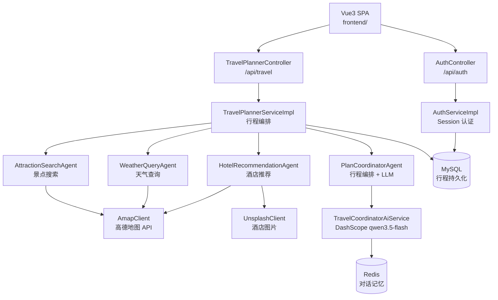

# Travel Planner Assistant

更新时间：2026-05-20

## 项目定位

这是一个基于 Spring Boot 3 + LangChain4j 的智能旅行规划助手，采用多 Agent 架构，通过 4 个专门的 Agent 协同完成旅行方案生成。

- 后端提供用户认证、行程 CRUD、多 Agent 编排、外部 API 集成
- 前端是 Vue3 + TypeScript SPA，支持表单输入、行程详情展示、地图可视化、PDF 导出
- 数据持久化使用 MySQL + MyBatis-Plus，会话记忆使用 Redis
- 外部服务集成：高德地图 API（POI 搜索、天气）、Unsplash API（酒店图片）、DashScope LLM（行程概述生成）

## 技术栈

- Java 17
- Spring Boot 3.5.14
- Spring Security（Session 认证）
- LangChain4j 1.0.1（AiService + Tool Use）
- MyBatis-Plus 3.5.15
- MySQL 8 + Redis 7
- Vue 3.5 + TypeScript + Pinia + Vue Router + Element Plus + Axios
- 高德地图 JS API 2.0

## 架构总览



## 代码结构

```
src/main/java/org/example/ragdemo/
  TravelPlannerApplication.java          # 启动入口
  config/
    LangChain4jConfig.java               # LLM 模型 + AiService + Redis ChatMemory
    SecurityConfig.java                   # Session 认证、BCrypt、路径权限
    TravelPlannerProperties.java          # 目的地/偏好/预算等表单选项配置
    TravelApiProperties.java              # 高德/天气/Unsplash API 配置
    ChatMemoryProperties.java             # Redis 对话记忆配置
    HttpClientConfig.java                 # RestClient 配置
    RedisConfig.java                      # Redis 配置
    MybatisPlusMetaObjectHandler.java     # 自动填充 created_at/updated_at
  controller/
    AuthController.java                   # /api/auth 注册/登录/登出/当前用户
    TravelPlannerController.java          # /api/travel 行程 CRUD + 收藏
    TravelPlannerExceptionHandler.java    # 全局异常处理
  service/
    AuthService.java / AuthServiceImpl.java
    TravelPlannerService.java / TravelPlannerServiceImpl.java
    support/TravelPlanAssembler.java      # JSON 序列化/反序列化
  entity/
    UserEntity.java / TripSessionEntity.java
    ItineraryEntity.java / ItineraryRevisionEntity.java
  mapper/
    UserMapper.java / TripSessionMapper.java
    ItineraryMapper.java / ItineraryRevisionMapper.java
  model/                                  # DTO: 请求/响应记录类
  security/
    SessionAuthenticationFilter.java      # Session → SecurityContext 过滤器
  travel/
    agent/                                # 4 个专门 Agent（接口 + 实现）
    client/                               # 外部 API 客户端（高德/Unsplash）
    gateway/                              # 数据网关接口 + Mock 实现
    memory/RedisChatMemoryStore.java      # Redis 对话记忆存储
    tool/TravelPlanningTools.java         # LangChain4j @Tool 方法

frontend/src/
  api/          # Axios HTTP 客户端 + API 端点
  types/        # TypeScript 类型定义
  stores/       # Pinia 状态管理
  views/        # 页面视图
  components/   # 可复用组件
  layouts/      # 布局组件
```

## 关键流程

### 1. 用户认证

`AuthController` 提供注册/登录/登出，使用 BCrypt 密码哈希 + HttpSession 存储 userId，`SessionAuthenticationFilter` 在每次请求时恢复认证状态。

### 2. 行程创建（多 Agent 协同）

`POST /api/travel/itineraries` → `TravelPlannerServiceImpl.createItinerary()`:
1. `AttractionSearchAgent` → 通过高德 API 搜索景点 POI
2. `WeatherQueryAgent` → 通过高德 + Open-Meteo 获取天气预报
3. `HotelRecommendationAgent` → 搜索酒店 + Unsplash 获取图片
4. `PlanCoordinatorAgent` → 整合数据，调用 LLM 生成行程概述，构建每日行程

### 3. 行程修改

`POST /api/travel/itineraries/{id}/revise` 保留原请求参数，重新执行 Agent 链路，生成新版本并记录修订历史。

### 4. 前端展示

- `PlannerView` → 表单输入 + 选项加载
- `ItineraryDetailView` → 每日时间轴 + 高德地图路线可视化 + 天气/酒店卡片 + 修改提交
- `HistoryView` → 历史行程列表 + 筛选 + 收藏 + 删除
- `ItineraryPrintView` → 打印/PDF 导出

## API 端点

| 方法 | 路径 | 说明 |
|------|------|------|
| POST | `/api/auth/register` | 注册 |
| POST | `/api/auth/login` | 登录 |
| POST | `/api/auth/logout` | 登出 |
| GET | `/api/auth/me` | 当前用户 |
| GET | `/api/travel/options` | 表单选项 |
| POST | `/api/travel/plan` | 预览行程（不持久化） |
| POST | `/api/travel/itineraries` | 创建行程 |
| GET | `/api/travel/itineraries` | 历史列表（支持筛选） |
| GET | `/api/travel/itineraries/{id}` | 行程详情 |
| POST | `/api/travel/itineraries/{id}/revise` | 修改行程 |
| PUT | `/api/travel/itineraries/{id}/favorite` | 收藏/取消收藏 |
| DELETE | `/api/travel/itineraries/{id}` | 软删除行程 |

## 全局协作建议

- 修改行程编排逻辑时，查看 `service/impl/TravelPlannerServiceImpl.java`
- 修改 Agent 行为时，查看 `travel/agent/*Impl.java`
- 修改外部 API 调用时，查看 `travel/client/impl/RealAmapClient.java`
- 修改 LLM 集成时，查看 `config/LangChain4jConfig.java` + `travel/tool/TravelPlanningTools.java`
- 修改前端页面时，查看 `frontend/src/views/` 和 `frontend/src/components/`
- 修改 API 调用时，查看 `frontend/src/api/travel.ts`
- 如需验证行为，优先运行现有测试并补充 service 层测试
