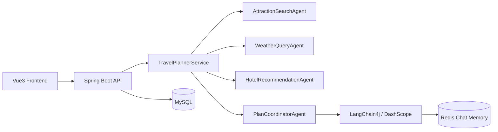

# Travel Planner Assistant

一个基于 **Spring Boot 3 + LangChain4j + Vue 3** 的智能旅行规划助手。

它面向“旅行规划”这一完整场景，支持从需求输入、AI 生成行程、历史管理、地图展示，到打印导出的完整闭环，适合作为 **AI 应用 / 全栈项目 / 多 Agent 编排** 的展示型作品。

---

## 项目亮点

- **多 Agent 协同规划**：拆分景点、天气、酒店、行程协调等职责
- **结构化 + LLM 编排**：先由后端收集结构化数据，再由大模型生成行程概述与每日安排
- **完整业务闭环**：支持注册登录、行程创建、历史记录、收藏、修订、删除
- **地图可视化**：支持路线点位展示与打印页导出
- **会话记忆**：基于 Redis 保存对话上下文，支持多轮修改

## 功能展示

- 用户注册 / 登录 / 登出
- 行程表单填写与智能生成
- 历史行程分页与筛选
- 行程详情：每日安排、预算、天气、酒店、路线地图
- 基于原始需求重新修订行程
- 打印页 / PDF 导出视图


## 技术栈

### Backend

- Java 17
- Spring Boot 3.5.14
- Spring Security（Session 认证）
- LangChain4j 1.0.1
- MyBatis-Plus 3.5.15
- MySQL 8
- Redis 7
- Spring Web / WebFlux

### Frontend

- Vue 3
- TypeScript
- Vite
- Pinia
- Vue Router
- Element Plus
- Axios
- 高德地图 JS API 2.0

## 系统架构

项目采用“**结构化数据准备 + LLM 编排行程**”的思路：

1. `AttractionSearchAgent` 获取景点候选
2. `WeatherQueryAgent` 获取天气信息
3. `HotelRecommendationAgent` 获取酒店建议
4. `PlanCoordinatorAgent` 汇总结果并调用大模型生成最终方案



## 项目结构

```text
src/main/java/org/example/demo/
  config/
  controller/
  entity/
  mapper/
  model/
  security/
  service/
  travel/

frontend/src/
  api/
  components/
  layouts/
  stores/
  types/
  views/
```

## 快速启动

### 环境要求

- JDK 17+
- Node.js 18+
- MySQL 8+
- Redis 7+

### 启动后端

```bash
mvn spring-boot:run
```

如果本机没有全局 Maven，可使用仓库内工具：

```bash
./.tools/apache-maven-3.9.14/bin/mvn spring-boot:run
```

后端默认地址：

```text
http://localhost:8080
```

### 启动前端

```bash
npm --prefix frontend install
npm --prefix frontend run dev
```

### 构建前端

```bash
npm --prefix frontend run build
```

## 配置说明

项目依赖以下基础服务：

- MySQL
- Redis
- LLM API
- 高德地图 API
- Unsplash API

敏感配置请通过**环境变量**注入，不要将真实密钥提交到 GitHub。

常用变量包括：

- `TRAVEL_DB_URL`
- `TRAVEL_DB_USERNAME`
- `TRAVEL_DB_PASSWORD`
- `TRAVEL_REDIS_HOST`
- `TRAVEL_REDIS_PORT`
- `TRAVEL_LLM_API_KEY`
- `TRAVEL_AMAP_API_KEY`
- `TRAVEL_UNSPLASH_ACCESS_KEY`
- `VITE_AMAP_KEY`

## 页面路由

- `/login`：登录页
- `/register`：注册页
- `/planner`：行程规划页
- `/history`：历史记录页
- `/itineraries/:id`：行程详情页
- `/itineraries/:id/print`：打印页

## 测试

后端：

```bash
mvn test
```

或：

```bash
./.tools/apache-maven-3.9.14/bin/mvn test
```

前端构建校验：

```bash
npm --prefix frontend run build
```

## 适合作为作品集展示的点

- 一个完整的 AI + 全栈项目，而不是单纯的 API demo
- 包含认证、数据库、缓存、外部 API、地图、LLM、多 Agent 编排
- 同时覆盖“业务闭环”和“AI 应用能力”

